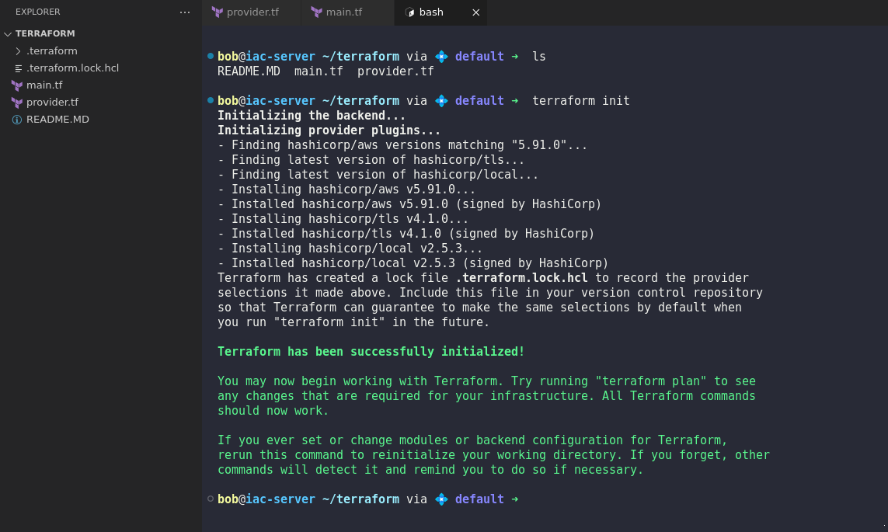

# Git hard reset

### Tasks

1. Navigate to `/usr/src/kodekloudrepos/demo` git repository on the Storage server.
2. Reset the repository so that only two commits remain:
   * `initial commit`
   * `add data.txt file`
3. Make sure the working directory and HEAD are aligned to `add data.txt file`.
4. Push the updated state to the remote, replacing existing history.

### Steps



SSH to storage server and switch to root if needed

```
ssh natasha@ststor01
sudo su -
```



### Navigate to demo directory

```
cd /usr/src/kodekloudrepos/demo
```



Find the commit hash for "add data.txt file"

```
git log --oneline
```

<figure><figcaption></figcaption></figure>



Reset to "add data.txt file"

```
git rebase -i --root
```

<figure><figcaption></figcaption></figure>



Keep only:

* `initial commit`
* `add data.txt file`

(Delete or drop other commits in the interactive editor)

```
git rebase -i --root
```



Force push cleaned-up history

```
git push origin master --force
```



Verify only two commits remain

```
git log --oneline
```

<figure><figcaption></figcaption></figure>


