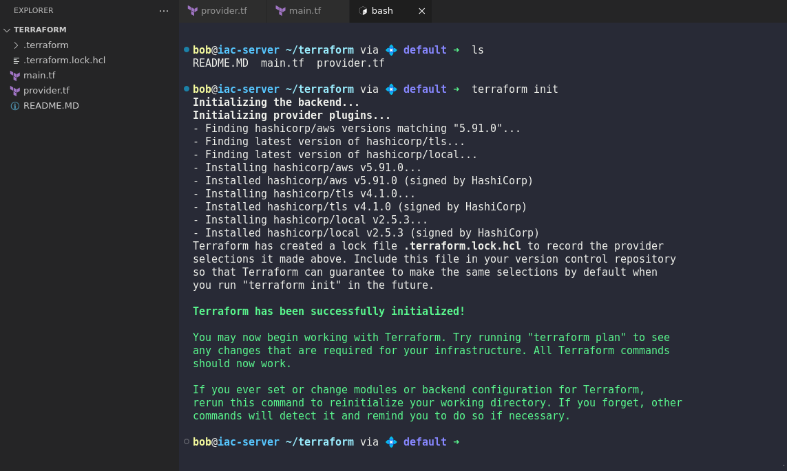

# Indexes in Splunk

#### Indexes in Splunk

An index in Splunk is a repository for data. It is used to store and organize information for fast retrieval. Indexes help in categorizing data for specific uses and access controls. Here are key points to consider:

* **Types of Indexes**:
  * _Events Index_: Generally used for time-series data.
  * _Metrics Index_: Suitable for numeric/metric data.
* **Retention Policies**: Configure policies to manage disk space by setting maximum size limits or data retention periods.
* **Performance**: Proper index management improves query performance and data retrieval speed.
* **Access Control**: Restrict access to specific indexes to maintain data privacy and security.

Understanding and efficiently managing indexes ensures optimal data handling within Splunk.

<figure><figcaption></figcaption></figure>

**All these are default indexes in splunk which can't be deleted or disabled.**

<figure><figcaption></figcaption></figure>

Still issue on searching. Wait let's fix this first.&#x20;

Adjust Splunk's Minimum Free Space Requirement

```bash
sudo nano /opt/splunk/etc/system/local/server.conf

```

<pre class="language-bash"><code class="lang-bash"><strong># Add or modify:
</strong>
[diskUsage]
minFreeSpace = 500

Copy code

</code></pre>

<figure><figcaption></figcaption></figure>

```bash
# save and restart
sudo /opt/splunk/bin/splunk restart

```

It's should work now. Please wait for a while and try a sample search index.

```
index="_internal"
```


<figure><figcaption></figcaption></figure>

Waah! It's working now. Cool, we can move forward to our Splunk learning.

